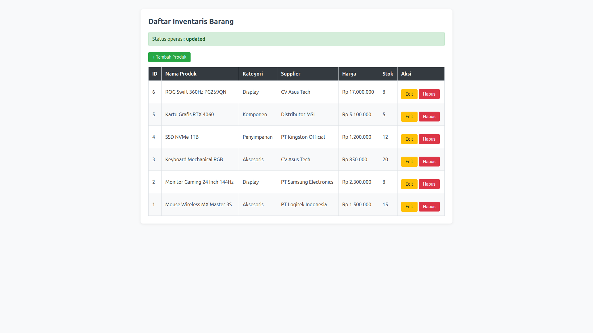

# Tugas Rutin 8: CRUD Inventaris Barang (PHP PDO & MySQL)

Proyek aplikasi web inventaris barang sederhana berbasis PHP Native menggunakan **PDO (PHP Data Objects)** dengan pola **Singleton Pattern** dan **Prepared Statements** untuk keamanan dari SQL Injection.



## Fitur Aplikasi
1. **Read**: Menampilkan daftar barang beserta nama Kategori dan Supplier (menggunakan SQL `JOIN`).
2. **Create**: Menambah data produk baru dengan pilihan dropdown Kategori dan Supplier.
3. **Update**: Mengubah data produk dengan form pre-filled.
4. **Delete**: Menghapus data produk dengan konfirmasi JavaScript.
5. **Keamanan**: Pencegahan SQL Injection via Prepared Statements dan sanitasi output HTML dengan `htmlspecialchars()`.

## Tumpukan Teknologi (Tech Stack)
- **Language**: PHP 8.x
- **Database**: MySQL Server 8.x
- **Driver DB**: PDO MySQL
- **Web Server**: PHP Built-in Development Server
- **Client/Tools**: Linux Ubuntu CLI, VS Code

## Cara Menjalankan Proyek Secara Lokal

1. **Clone Repository**:
   ````bash
    git clone [https://github.com/USERNAME_KAMU/TugasWeb-Pertemuan8-CRUD.git](https://github.com/USERNAME_KAMU/TugasWeb-Pertemuan8-CRUD.git)
    cd TugasWeb-Pertemuan8-CRUD